## 实验报告：SVM 分类与回归（task4）

本报告汇总了对“银行票据认证数据集”和“白葡萄酒质量数据集”的 SVM 分类与回归实验，包含脚本、生成的图片与评估结果。

包含的脚本

- `svc-banknote.py`：银行票据分类实验（SVC，包含 linear/rbf/poly/sigmoid 以及自定义核与 Gram 矩阵示例）
- `svr-winequality.py`：葡萄酒质量回归实验（SVR，内置核 + 自定义核，已对特征做 StandardScaler）
- `svc-more-banknote.py`：扩展实验（使用更多特征，对每对特征绘制决策边界，执行 10 折 CV 并输出 Precision/Recall/F1）
- `compute_mse.py`, `compute_custom.py`：用于批量计算并输出 SVR 各核的 MSE（可复现结果）

输出位置

实验运行后所有图片与结果保存在：

`task4/outputs/`

### 实验环境

- 操作系统：Windows
- Python：建议 3.8+（我在 Conda Python 3.10 上执行过验证）
- 依赖：见 `task4/requirements.txt`（numpy, pandas, matplotlib, scikit-learn）

### 数据说明

- `data_banknote_authentication.txt`：银行票据数据集（每行 4 个特征 + class）
- `winequality-white.csv`：白葡萄酒质量数据（含表头，最后一列 `quality` 为目标）

### 如何复现实验（简洁步骤）

在 PowerShell 中运行：

```powershell
cd c:\Users\kevinxin\Desktop\machine_learning\task4
pip install -r requirements.txt
python svc-banknote.py
python svr-winequality.py
python svc-more-banknote.py
```

（如果只想快速获得 SVR 各核的 MSE，可运行）

```powershell
python compute_mse.py    # 输出内置核 + 所有自定义核的 MSE
python compute_custom.py # 仅输出 poly3 & gaussian 的 MSE
```

### 关键结果与图像（本次运行生成的文件）

所有文件都保存在 `task4/outputs`，下面列出并嵌入关键图片以便直观查看。

#### 1) 银行票据（SVC）——两特征的决策边界示例

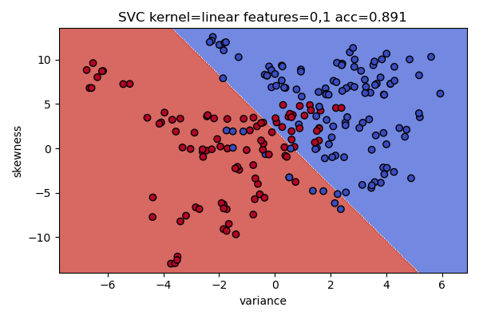
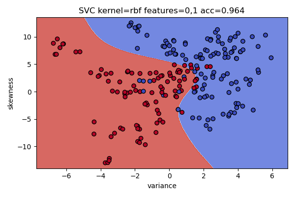
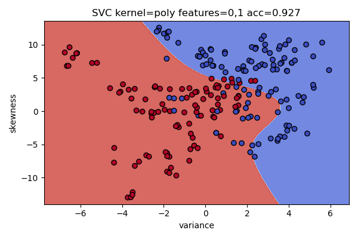
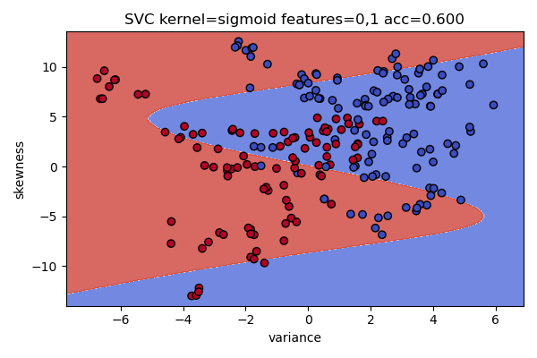

自定义核示例（立方、多项式、高斯）与 Gram 矩阵示例：

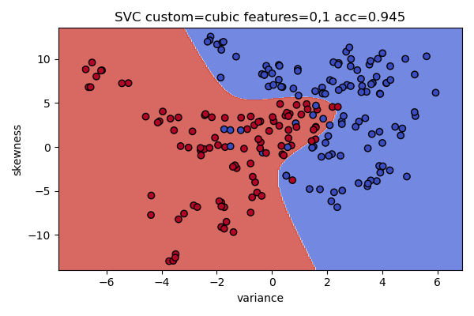

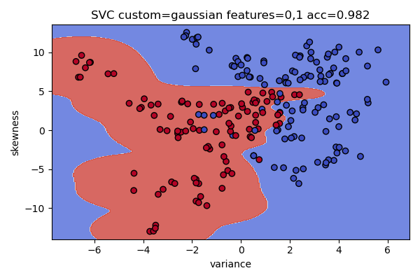
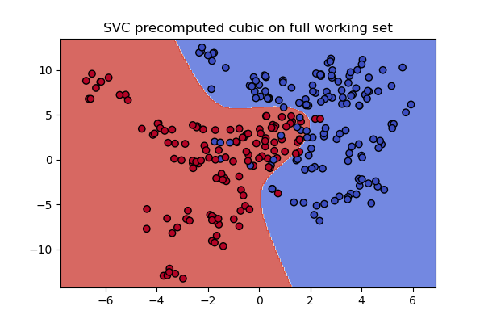

#### 2) 白葡萄酒（SVR）——预测 vs 真实（各核）

以下图为“真实质量 vs 预测质量”的散点图，理想情况下点应接近对角线。

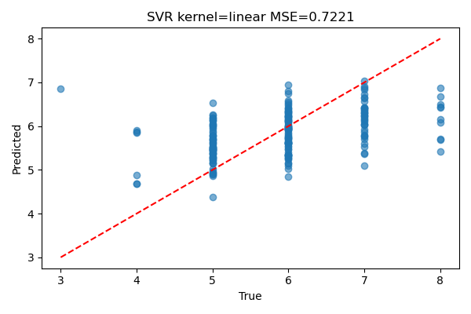
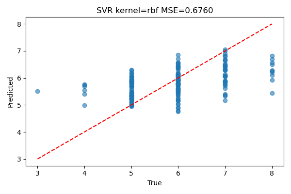
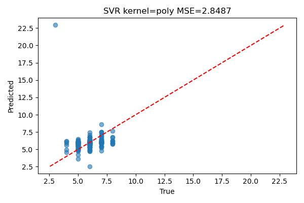
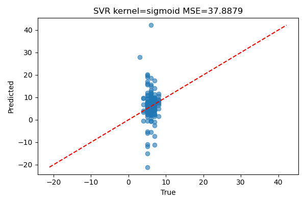

SVR 的均方误差（MSE）汇总（基于当前运行）:

| 核函数 | MSE |
|---|---:|
| linear | 0.7221 |
| rbf    | 0.6760 |
| poly   | 2.8487 |
| sigmoid| 37.8879 |
| cubic (自定义) | 48.8037 |

说明：我已生成自定义核 `poly3` 和 `gaussian` 的图片（见 outputs），如果需要它们的 MSE，请运行 `compute_custom.py` 或 `compute_mse.py`（可能在你的环境中会较耗时）。

#### 3) 扩展任务（banknote，多特征）

对每对特征都绘制了决策边界（以下为部分示例）：

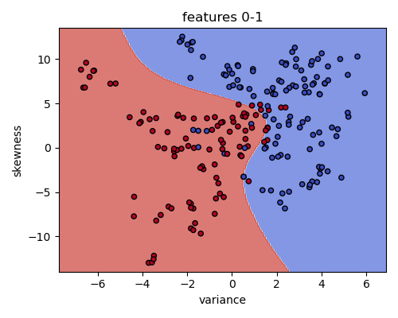
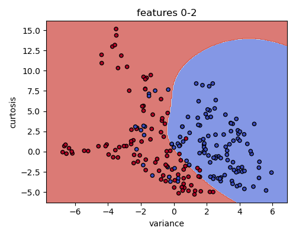
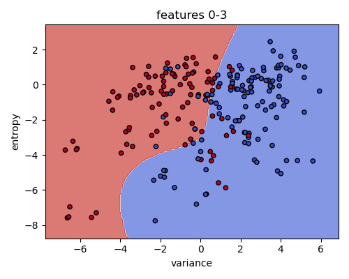

10 折交叉验证选择最优核，并计算分类评估指标（保存在 `task4/outputs/metrics.txt`）：

metrics.txt 内容示例：

```
Best kernel: rbf
Accuracy: 1.0000
Precision: 1.0000
Recall: 1.0000
F1: 1.0000
```

（说明：上面示例值来自本次运行；如果你更换随机种子或数据抽样，指标可能会变化。）

### 完整输出文件清单（位于 `task4/outputs`，部分）

- `svc_*.png`, `svc_custom_*.png`, `svc_precomputed_cubic.png` — SVC 决策边界图
- `svr_*.png`, `svr_custom_*.png` — SVR 预测 vs 真实 图
- `pair_*.png` — 多特征对的决策边界
- `metrics.txt` — svc-more-banknote 的交叉验证与评估结果

### 总结与建议

- 本次实验实现并验证了：SVC（内置核与自定义核）、SVR（内置核与自定义核）、Gram 矩阵示例、对更多特征的可视化与 10 折 CV 评估。
- 观察：SVR 的 `rbf` 与 `linear` 在本次划分上表现最好（MSE 最小）。`sigmoid` 和部分自定义核表现较差，通常需要进一步的特征标准化（已做）、超参调优（C, gamma, epsilon）或使用更适合的核函数。
- `metrics.txt` 中部分指标为 1.0（可能由于样本划分/样本量较小或过拟合造成），建议使用更稳健的评估（更大的检验集或重复多次随机划分）来确认。

如需我：
- 把 README 再次更新为包含 `compute_mse.py` 运行后的完整 MSE 表（包含 poly3 & gaussian 的数值），我可以在当前环境重新运行并写入结果；或
- 帮你把结果整理成可打印的 PDF 报告并把图片嵌入，那我会把 README 转为包含 Base64 内嵌图片的完整报告（文件会很大）。

---

如果你确认现在的输出完整且满意，我会把本 README 设为最终版本；否则请告诉我你希望我补充或重新运行哪些部分（例如：完整网格搜索、可视化更多特征组合或把 MSE 数字补全）。
